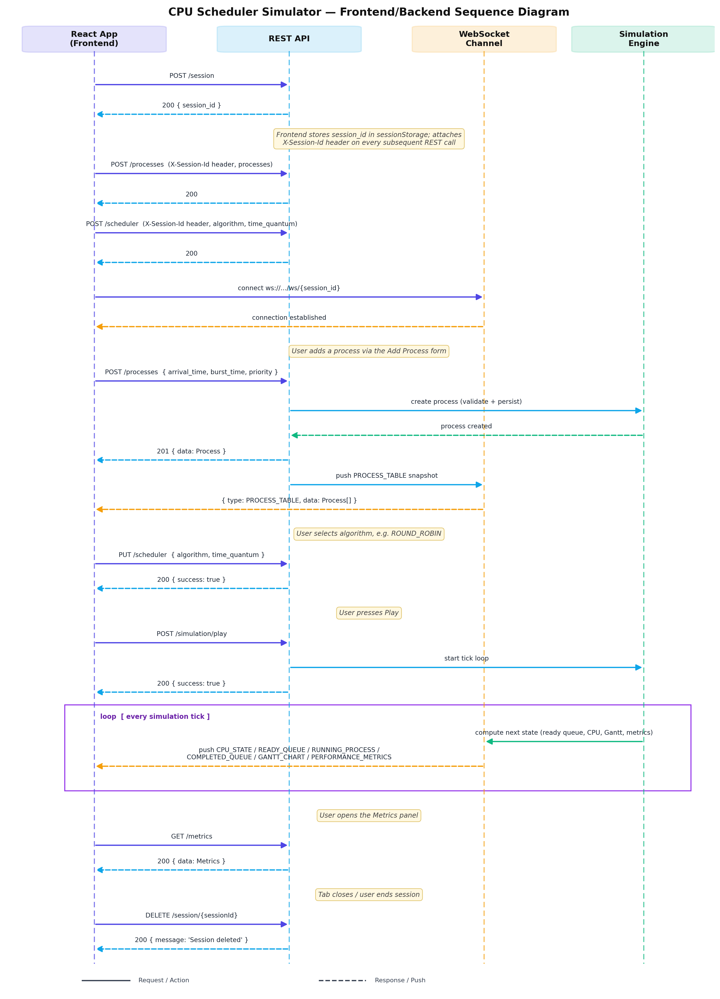

# CPU Scheduler Simulator — Frontend API Integration Guide

**Version:** 1.0
**Base URL:** `http://<host>/api/v1`
**WebSocket URL:** `ws://<host>/api/v1/ws/{sessionId}`
**Source:** Backend. 
This document describes the *contract* — request shapes, response shapes, field types, and workflow — so the developer can be built with further clarified objective.

---

## Table of Contents

1. [Conventions](#1-conventions)
2. [Data Models](#2-data-models)
3. [Session APIs](#3-session-apis)
4. [Process APIs](#4-process-apis)
5. [Scheduler APIs](#5-scheduler-apis)
6. [Simulation Control APIs](#6-simulation-control-apis)
7. [Metrics API](#7-metrics-api)
8. [WebSocket — Live Updates](#8-websocket--live-updates)
9. [Error Handling](#9-error-handling)
10. [End-to-End Frontend Workflow](#10-end-to-end-frontend-workflow)
11. [Suggested React State Shape](#11-suggested-react-state-shape)

---

## 1. Conventions

- All request/response bodies are `application/json`.
- All timestamps/ticks are integers representing simulation time units (not wall-clock time).
- All endpoints (except session creation) require the session to be established first. Send the session id as a header on every REST call:
  ```
  X-Session-Id: <session_id>
  ```
- Every successful response follows the envelope:
  ```json
  { "success": true, "data": { } }
  ```
  `data` may be an object, array, or absent (for actions that only need `success`/`message`).
- Every failed response follows the envelope described in [Section 9](#9-error-handling).
- IDs: `session_id` is a string (UUID). `process_id` is an integer, auto-assigned by the backend on creation — **never sent by the frontend**.


---

## 3. Session APIs

Every browser tab/user needs an isolated session before touching any other endpoint. Store `session_id` in `sessionStorage` (not `localStorage`, so each tab gets its own simulation).

### 3.1 Create Session

`POST /api/v1/session`

**Request Body:** none

**Response `200`:**
```json
{ "success": true, "data": { "session_id": "b7e6c9d2-..." } }
```

**Frontend action:** Save `session_id` to `sessionStorage.setItem('session_id', ...)`, attach it as `X-Session-Id` header on all future REST calls, then open the WebSocket at `ws://<host>/api/v1/ws/{session_id}`.

### 3.2 Delete Session

`DELETE /api/v1/session/{sessionId}`

**Path Parameters**

| Param | Type | Required | Description |
|---|---|---|---|
| sessionId | string | Yes | Session to destroy |

**Response `200`:**
```json
{ "success": true, "message": "Session deleted" }
```

**Frontend action:** Call on tab unload / explicit "End Session" button. Close the WebSocket afterward.

---

## 4. Process APIs

### 4.1 List Processes

`POST /api/v1/processes`

**Request Body:**
```json
{ "session_id" : "sessionId"
  "data": [
    {
      "id": 1,
      "arrival_time": 0,
      "burst_time": 5,
      "priority": 2,
      "remaining_time": 5,
      "status": "waiting",
      "start_time": null,
      "completion_time": null,
      "color": "#4F46E5"
    }
  ]
}
```

**Response `200`:**
```json
{ "success": true }
```

### 4.2 Add Process

`POST /api/v1/processes`

**Request Body**

| Field | Type | Required | Description |
|---|---|---|---|
| arrival_time | integer (≥ 0) | Yes | Tick at which the process arrives |
| burst_time | integer (> 0) | Yes | Total CPU burst time required |
| priority | integer (≥ 0) | No | Only meaningful for `PRIORITY` / `PRIORITY_PREEMPTIVE` algorithms; omit or send `null` otherwise |

**Example Request**
```json
{"session_id": 1, "id": 5, "arrival_time": 0, "burst_time": 5, "priority": 2 }
```

**Response `201`:**
```json
{ "success": true }
```

**Form fields for the "Add Process" modal** (this is the equivalent of your "student add form" example):

| UI Label | Field | Input Type | Validation |
|---|---|---|---|
| Arrival Time | `arrival_time` | number | integer, min 0 |
| Burst Time | `burst_time` | number | integer, min 1 |
| Priority | `priority` | number | integer, min 0; only shown/enabled when algorithm is `PRIORITY` or `PRIORITY_PREEMPTIVE` |

### 4.3 Update Process

`PUT /api/v1/processes/{processId}`

**Path Parameters**

| Param | Type | Required | Description |
|---|---|---|---|
| processId | integer | Yes | ID of the process to update |

**Request Body:** same shape as Add Process (`arrival_time`, `burst_time`, `priority`).

> **Note:** Editing a process that has already started running mid-simulation is backend-validated. If the simulation is not in a fresh/reset state, expect a `409` error (see [Section 9](#9-error-handling)) — the frontend should disable the Edit action for processes once `status !== "waiting"` or the simulation has been started, and surface the returned error message if the call is attempted anyway.

**Response `200`:**
```json
{ "success": true }
```

### 4.4 Delete Process

`DELETE /api/v1/processes/{processId}`

**Path Parameters**

| Param | Type | Required | Description |
|---|---|---|---|
| processId | integer | Yes | ID of the process to delete |

**Response `200`:**
```json
{ "success": true }
```

---

## 5. Scheduler APIs

### 5.1 Get Scheduler Config

`POST /api/v1/scheduler`
**request body:**
```json
{
  "session_id": "1"
  "data": { "algorithm": "ROUND_ROBIN", "time_quantum": 4 }
}

```


**Response `200`:**
```json
{ "success": true }
```

### 5.2 Update Scheduler Config

`PUT /api/v1/scheduler`

**Request Body**

| Field | Type | Required | Description |
|---|---|---|---|
| algorithm | string (enum) | Yes | One of `FCFS`, `SJF`, `SJF_PREEMPTIVE`, `PRIORITY`, `PRIORITY_PREEMPTIVE`, `ROUND_ROBIN` |
| time_quantum | integer (> 0) | Conditional | **Required** when `algorithm === "ROUND_ROBIN"`. Omit/`null` for all other algorithms. |

**Example Request (Round Robin)**
```json
{ "algorithm": "ROUND_ROBIN", "time_quantum": 4 }
```

**Example Request (any other algorithm)**
```json
{ "algorithm": "SJF_PREEMPTIVE", "time_quantum": null }
```

**Response `200`:**
```json
{ "success": true }
```

**UI guidance:** Render an "Algorithm" dropdown with the six enum values (use friendly labels: "First Come First Serve", "Shortest Job First", "Shortest Remaining Time First", "Priority (Non-Preemptive)", "Priority (Preemptive)", "Round Robin"). Show a "Time Quantum" number input **only** when `ROUND_ROBIN` is selected, and validate it's required in that case before enabling Save.

---

## 6. Simulation Control APIs

All endpoints below take **no request body** except `PUT /simulation/speed`, and all return `{ "success": true }` on success. State changes are reflected via the WebSocket stream, not the REST response — the REST call is a command, the WebSocket push is the result.

| Action | Endpoint | Method | Notes |
|---|---|---|---|
| Start | `/api/v1/simulation/play` | POST | Begins simulation from tick 0 (or current state if resuming after reset) |
| Pause | `/api/v1/simulation/pause` | POST | Freezes the simulation clock; WebSocket stops advancing |
| Resume | `/api/v1/simulation/resume` | POST | Continues from paused tick |
| Reset | `/api/v1/simulation/reset` | POST | Clears all runtime state (ready queue, completed queue, Gantt chart) back to tick 0; processes list is preserved but `status`/`remaining_time`/etc. are recalculated |
| Step | `/api/v1/simulation/step` | POST | Advances exactly one tick, then pauses |
| Previous | `/api/v1/simulation/previous` | POST | Rewinds one tick using history buffer |
| Fast Forward | `/api/v1/simulation/forward` | POST | Jumps ahead — exact tick-skip amount is backend-defined; treat as "advance until next state-change event" |

### 6.1 Change Speed

`PUT /api/v1/simulation/speed`

**Request Body**

| Field | Type | Required | Description |
|---|---|---|---|
| speed | integer (enum) | Yes | Allowed values: `1`, `2`, `5` (multiplier applied to tick interval) |

**Example Request**
```json
{ "speed": 2 }
```

**Response `200`:**
```json
{ "success": true }
```

**UI guidance:** Render speed control as a segmented control / toggle group with exactly three options: `1x`, `2x`, `5x`. Play/Pause/Step/Previous/Forward buttons map 1:1 to standard media-player-style controls; disable Step/Previous while the simulation is actively playing (only enable them while paused).

---

## 7. Metrics API

`GET /api/v1/metrics`

**Response `200`:**
```json
{
  "success": true,
  "data": {
    "waiting_time": {
      "per_process": { "1": 3, "2": 0, "3": 5 },
      "average": 2.67
    },
    "turnaround_time": {
      "per_process": { "1": 8, "2": 4, "3": 10 },
      "average": 7.33
    },
    "response_time": {
      "per_process": { "1": 0, "2": 0, "3": 2 },
      "average": 0.67
    },
    "completion_time": {
      "per_process": { "1": 8, "2": 4, "3": 12 }
    },
    "cpu_utilization": 92.5
  }
}
```

**UI guidance:** Render a per-process metrics table (rows = process ID, columns = waiting/turnaround/response/completion time) plus a summary card row for the averages and CPU utilization percentage. This endpoint is typically called once the simulation reaches `completed` state, but can be polled at any time to show live/partial metrics.

---

## 8. WebSocket — Live Updates

**Check LLD Doc for details**

**Connect:** `ws://<host>/api/v1/ws/{sessionId}` — open immediately after session creation, and keep open for the lifetime of the tab.

The backend pushes a message every time simulation state changes (on `step`, `play` tick, `previous`, `reset`, process CRUD, or scheduler change). All messages share an envelope with a `type` discriminator so the frontend can route them to the right reducer action:

```ts
interface WsMessage<T> {
  type:
    | "PROCESS_TABLE"
    | "READY_QUEUE"
    | "RUNNING_PROCESS"
    | "COMPLETED_QUEUE"
    | "CPU_STATE"
    | "GANTT_CHART"
    | "PERFORMANCE_METRICS";
  data: T;
}
```

### 8.1 Message Payloads

| `type` | `data` shape | Description |
|---|---|---|
| `PROCESS_TABLE` | `Process[]` | Full snapshot of all processes (see [2.1](#21-process)) |
| `READY_QUEUE` | `number[]` (process IDs, in queue order) | Current ready queue order — critical for Round Robin / priority visualizations |
| `RUNNING_PROCESS` | `number \| null` | ID of process currently on CPU, or `null` if idle |
| `COMPLETED_QUEUE` | `number[]` | Process IDs completed so far, in completion order |
| `CPU_STATE` | `CpuState` (see [2.5](#25-cpu-state)) | Current tick + CPU busy/idle status |
| `GANTT_CHART` | `GanttEntry[]` (see [2.4](#24-gantt-chart-entry)) | Full Gantt chart built incrementally as the simulation runs |
| `PERFORMANCE_METRICS` | `Metrics` (see [2.3](#23-metrics)) | Same shape as the REST `/metrics` response; pushed live once processes start completing |

### 8.2 Example Frames

```json
{ "type": "CPU_STATE", "data": { "status": "busy", "running_process_id": 2, "current_tick": 7 } }
```
```json
{ "type": "READY_QUEUE", "data": [3, 4, 1] }
```
```json
{ "type": "GANTT_CHART", "data": [
  { "process_id": 1, "start": 0, "end": 4 },
  { "process_id": null, "start": 4, "end": 5 },
  { "process_id": 2, "start": 5, "end": 9 }
] }
```

**Frontend action:** Maintain a single reducer keyed off `message.type` that merges each payload into the corresponding slice of React state (see [Section 11](#11-suggested-react-state-shape)). Do not assume ordering across message types within the same tick — treat each as an independent, idempotent snapshot update.

---

## 9. Error Handling

All non-2xx responses follow this shape:

```json
{
  "success": false,
  "error": {
    "code": "VALIDATION_ERROR",
    "message": "burst_time must be a positive integer"
  }
}
```

| HTTP Status | Example `code` | Meaning |
|---|---|---|
| 400 | `VALIDATION_ERROR` | Missing/invalid field in request body |
| 404 | `NOT_FOUND` | Session, process, or resource doesn't exist |
| 409 | `INVALID_STATE` | Action not allowed in current simulation state (e.g. editing a process mid-run) |
| 401 | `SESSION_EXPIRED` | `X-Session-Id` missing, invalid, or expired — frontend should recreate a session |
| 500 | `INTERNAL_ERROR` | Unexpected backend failure |

**Frontend guidance:** Wrap all API calls in a shared client (e.g. an Axios instance) with a response interceptor that unwraps `success`/`error` and throws a typed error for React Query / your data layer to catch and surface as a toast/snackbar. On `SESSION_EXPIRED`, silently call `POST /session` again and retry once.

---

## 10. End-to-End Frontend Workflow

```
On app load:
  1. POST /session                     → store session_id
  2. GET /processes                    → hydrate process table
  3. GET /scheduler                    → hydrate algorithm/quantum controls
  4. Open WebSocket ws://.../ws/{session_id}

User adds a process:
  → POST /processes  { arrival_time, burst_time, priority }
  → WebSocket pushes updated PROCESS_TABLE

User edits a process:
  → PUT /processes/{id}  { arrival_time, burst_time, priority }
  → WebSocket pushes updated PROCESS_TABLE

User deletes a process:
  → DELETE /processes/{id}
  → WebSocket pushes updated PROCESS_TABLE

User changes algorithm:
  → PUT /scheduler  { algorithm, time_quantum }

User presses Play:
  → POST /simulation/play
  → WebSocket streams CPU_STATE / READY_QUEUE / RUNNING_PROCESS /
    COMPLETED_QUEUE / GANTT_CHART / PERFORMANCE_METRICS on every tick

User presses Pause / Resume / Step / Previous / Forward / Reset:
  → Corresponding POST /simulation/{action}
  → WebSocket reflects the new state

User changes speed:
  → PUT /simulation/speed  { speed }

User opens Metrics panel:
  → GET /metrics  (or read the latest PERFORMANCE_METRICS pushed over WS)

On tab close / "End Session":
  → DELETE /session/{sessionId}
  → close WebSocket
```


<p align="center">
  
</p>
