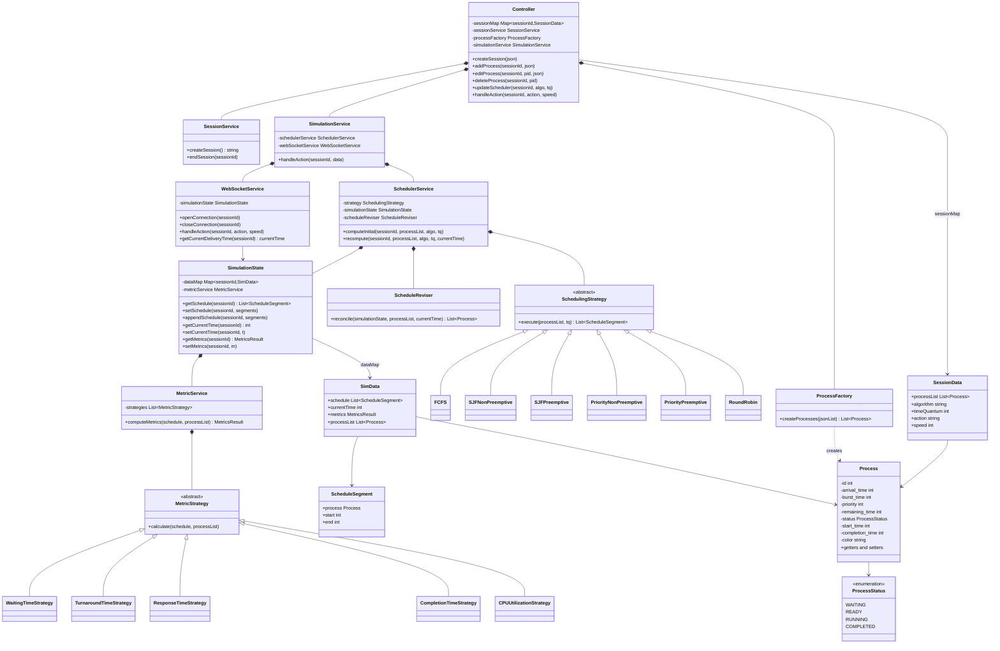

# CPU Scheduling Simulator — Low Level Design Doc




# PSV — Request Lifecycle Documentation

This document describes how a single API call travels through the backend, from the moment it hits `Controller` to the moment the WebSocket starts streaming simulation state back to the client.

---

## 1. Request Arrives at Controller

Every API call lands on `Controller` first. Based on the request type, Controller routes it differently:

| Request type | Controller's action |
|---|---|
| **Create session** | Calls `SessionService.createSession()` to get a new `sessionId`. Calls `ProcessFactory.createProcesses(json)` once, for the initial process list. Creates a new entry in its own `sessionMap` keyed by that `sessionId`, storing `{processList, algorithm, timeQuantum, action, speed}`. |
| **Add / Edit / Delete process** | Builds or mutates a `Process` object directly (`new Process()` + setters — no `ProcessFactory` involved after session creation). Updates the process list stored in `sessionMap[sessionId]`. |
| **Update scheduler config** (algorithm / time quantum) | Updates the `algorithm` / `timeQuantum` fields in `sessionMap[sessionId]`. |
| **Simulation control action** (play, pause, resume, reset, step, previous, forward, speed) | Reads `sessionMap[sessionId]` and forwards the whole bundle — `{sessionId, processList, algorithm, timeQuantum, action, speed}` — to `SimulationService`. |

Controller does not compute anything itself — it only validates the session exists, keeps the per-session config current, and hands off simulation control requests to `SimulationService`.

---

## 2. Simulation Service Interprets the Action

`SimulationService` receives the bundle and looks at `action` to decide which downstream service should handle it:

- **Actions that change the underlying data** — first `PLAY`, `Add/Edit/Delete process`, or an **algorithm switch** — get forwarded to `SchedulerService`, because the schedule itself needs to be (re)computed. It fetch currentTime for websocket.
- **Actions that only affect playback** — `PAUSE`, `RESUME`, `STEP`, `PREVIOUS`, `FAST_FORWARD`, `RESET`, `SPEED` — get forwarded straight to `WebSocketService`, because the schedule doesn't change; only where we are in it, or how fast we move through it, changes.

---

## 3. Scheduler Service Computes / Recomputes

`SchedulerService` holds three collaborators: `SchedulingStrategy`, `SimulationState`, and `ScheduleReviser`.

**First computation** (nothing scheduled yet for this session):
1. The full `processList` is handed straight to the current `SchedulingStrategy`.
2. `SchedulingStrategy` batch-computes the entire schedule in one go and returns it as a list of `ScheduleSegment` (`process, start, end`).
3. `SchedulerService` writes this into `SimulationState` for that `sessionId`.

**Any later data change** (a process is added/edited/deleted, or the algorithm is switched mid-run):
1. `ScheduleReviser` is triggered first. And change process list according to currentTime.
2. It **keeps** every segment that has already happened (`end <= currentTime`) — the past is immutable.
3. It **discards** every segment scheduled after `currentTime` — those are now invalid because the data changed.
4. It works out the **remaining process list**: for each unfinished process, remaining burst = original burst − whatever was already executed; finished processes are dropped; newly added processes are included with full burst.
5. This remaining list is handed to `SchedulingStrategy`, which computes a fresh schedule starting at `currentTime`.
6. `SchedulerService` appends this new chunk onto the retained history already sitting in `SimulationState`.

So `SchedulingStrategy` itself is a pure function — process list in, segments out. It never touches `SimulationState` directly; `SchedulerService` is the one that reads its output and writes it in.

---

## 4. Simulation State — Where Everything Ends Up

All computed and derived data lives in `SimulationState`, keyed by `sessionId`:

```
SimulationState:
  sessionId → {
    schedule: [ScheduleSegment, ScheduleSegment, ...]   // process, start, end
    currentTime: int
    metrics: MetricsResult                               // waiting/turnaround/response/completion/CPU-util
    processList: [Process, ...]                           // live status, remaining_time, etc.
  }
```

Every time the schedule changes, `SimulationState` also triggers `MetricService.computeMetrics(...)` and stores the fresh result. Nothing outside `SimulationState` holds a second copy of this data — `SchedulerService` and `WebSocketService` both read/write through it using getters and setters.

---

## 5. WebSocket Service — Streaming the Schedule

`WebSocketService` takes its orders from `SimulationService` (play / pause / stop / speed) and streams the corresponding session's data out of `SimulationState`, one segment at a time:

1. It pulls the current `ScheduleSegment` — `{process, start, end}` — for the session, starting from `currentTime`.
2. It sends that segment to the client immediately: *this process is running, from `start` to `end`*.
3. It then **sleeps until `end`** is reached (scaled by the current `speed` — 1×, 2×, 5×).
4. When `end` arrives, it moves to the **next segment** in the schedule and repeats: send `{process, start, end}`, sleep until `end`, repeat.
5. If a **stop/pause** order comes in from `SimulationService` at any point, the loop halts immediately — it does not send the next segment until told to resume.
6. `STEP` / `PREVIOUS` / `RESET` / `FAST_FORWARD` all just move the "current position" pointer in this same loop without changing the underlying schedule.

This is effectively a per-session playback loop sitting on top of an already-computed Gantt chart: `WebSocketService` never calculates anything — it only walks the segments in `SimulationState` at the pace `SimulationService` tells it to.

---

## End-to-End Summary

```
API Request
     │
     ▼
Controller ── validates session, updates sessionMap
     │
     ├── (session/process/config change) → done, no further hop
     │
     └── (simulation control action) → SimulationService
                                              │
                              ┌───────────────┴────────────────┐
                              │                                │
                    (data changed: play/add/edit/          (playback only: pause/
                     delete/algorithm switch)                resume/step/previous/
                              │                              reset/forward/speed)
                              ▼                                │
                     SchedulerService                          │
                              │                                │
                    ScheduleReviser (trim + derive              │
                    remaining processes, if not                │
                    first computation)                          │
                              │                                │
                    SchedulingStrategy.execute()                │
                              │                                │
                    write/append → SimulationState              │
                              │                                │
                    MetricService recomputes metrics            │
                              │                                │
                              └───────────────┬────────────────┘
                                               ▼
                                      WebSocketService
                                (reads SimulationState, streams
                                 segment-by-segment, sleeping
                                 until each segment's end time,
                                 stoppable at any point)
                                               │
                                               ▼
                                      React Frontend
```