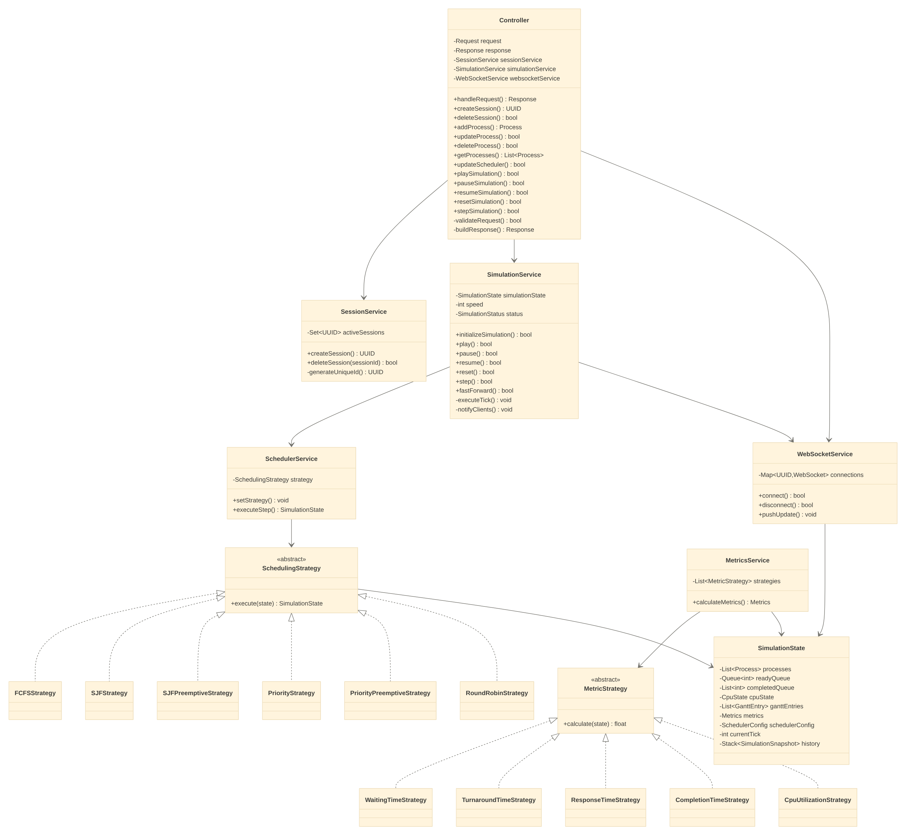

# CPU Scheduling Simulator — Design Doc

## 1. Architecture Overview

```
User → React Frontend ⇄ Controller ⇄ Session Service
                              │
                              ├──► Simulation Service ──► Scheduler Service ──► Scheduling Algorithms
                              │                                                        │
                              └──► WebSocket Service ⇄ Simulation State ⇄ Metrics Service
```

The system is a layered backend: a single **Controller** exposes REST endpoints, delegates work to focused services, and all services communicate through one shared **Simulation State** (in-memory) which the **WebSocket Service** streams to the frontend.


## 2. Design Patterns Used

| Pattern | Where | Why |
|---|---|---|
| **Facade** | Controller | Hides all internal services behind one simple API surface for the frontend |
| **Strategy** | Scheduling Algorithms (via Scheduler Service) | Swap the active scheduling algorithm at runtime without changing Scheduler Service code |
| **Strategy** | Metric Calculators (via Metrics Service) | Each metric (waiting, turnaround, response, completion, CPU utilization) is computed independently and can be added/removed without touching Metrics Service |
| **Memento**-style snapshotting | Simulation State's `history` stack | Enables step-back / previous-state playback without recomputation |
| **Observer**-style push | WebSocket Service | Frontend is notified reactively on every state change rather than polling |

## 3. When Things Get Triggered

| Trigger (user/API action) | Flow |
|---|---|
| Open app / start new run | Controller → Session Service creates a session |
| Add/update/delete a process | Controller updates Simulation State directly via Simulation Service |
| Change algorithm (dropdown) | Controller → Simulation Service → Scheduler Service `setStrategy()` |
| Press Play | Controller → Simulation Service `play()` → begins ticking |
| Each tick (auto or manual step) | Simulation Service `executeTick()` → Scheduler Service `executeStep()` → active Strategy `execute(state)` → Simulation State updated |
| Pause / Resume / Reset | Controller → Simulation Service toggles internal status, halts or reinitializes ticking |
| Step back | Simulation Service pops from `history` stack in Simulation State |
| Change speed | Controller → Simulation Service `changeSpeed()` adjusts tick interval |
| After every state change | Simulation State change → WebSocket Service `pushUpdate()` → React Frontend re-renders |
| Metrics requested (or after run completes) | Metrics Service reads Simulation State → runs each Metric Strategy → returns aggregated `Metrics` |
| Delete session / close app | Controller → Session Service `deleteSession()` |

## 4. Notes

- Controller has no direct dependency on Scheduler Service or Metrics Service — all such work is routed through Simulation Service, keeping the Controller thin.
- Simulation State is the only shared mutable object; every other service reads/writes through it rather than holding its own copy.

---

<p align="center">
  
</p>

---

# Class Method Reference

## Controller

| Method | Responsible for |
|---|---|
| `handleRequest()` | Entry point that runs validate → process → build-response for every incoming call |
| `validateRequest()` | Checks the incoming request is well-formed before processing |
| `buildResponse()` | Wraps the result of processing into a standard API response |
| `createSession()` | Asks Session Service to start a new session |
| `deleteSession()` | Asks Session Service to end a session |
| `addProcess()` / `updateProcess()` / `deleteProcess()` / `getProcesses()` | CRUD on processes in the current simulation |
| `updateScheduler()` | Passes the selected algorithm to Simulation Service |
| `playSimulation()` / `pauseSimulation()` / `resumeSimulation()` / `resetSimulation()` | Starts, halts, resumes, or restarts the simulation |
| `stepSimulation()` | Advances the simulation by exactly one tick |

## Session Service

| Method | Responsible for |
|---|---|
| `createSession()` | Generates a new session ID and stores it as active |
| `deleteSession(sessionId)` | Removes a session from the active set |
| `generateUniqueId()` | Produces a UUID that isn't already in use |

## Simulation Service

| Method | Responsible for |
|---|---|
| `initializeSimulation()` | Sets up a fresh Simulation State for a run |
| `play()` | Starts automatic ticking |
| `pause()` | Stops automatic ticking without resetting state |
| `resume()` | Continues ticking after a pause |
| `reset()` | Clears state and starts over |
| `step()` | Runs one tick immediately (manual step) |
| `previous()` | Restores the last snapshot from history (step back) |
| `fastForward()` | Runs multiple ticks quickly |
| `changeSpeed(speed)` | Adjusts how fast ticks fire |
| `executeTick()` | Internal: calls Scheduler Service and pushes a new snapshot to history |
| `notifyClients()` | Internal: tells WebSocket Service state has changed |

## Scheduler Service

| Method | Responsible for |
|---|---|
| `setStrategy()` | Sets which scheduling algorithm is active |
| `executeStep()` | Delegates one scheduling decision to the active Strategy and returns updated state |

## Scheduling Strategy (abstract) + FCFS / SJF / SJF-Preemptive / Priority / Priority-Preemptive / Round Robin

| Method | Responsible for |
|---|---|
| `execute(state)` | Applies that specific algorithm's logic to pick/run the next process and update Simulation State |

## Metrics Service

| Method | Responsible for |
|---|---|
| `calculateMetrics()` | Runs every Metric Strategy against Simulation State and aggregates the results |

## Metric Strategy (abstract) + Waiting / Turnaround / Response / Completion / CPU-Utilization

| Method | Responsible for |
|---|---|
| `calculate(state)` | Computes that one specific metric from Simulation State |

## WebSocket Service

| Method | Responsible for |
|---|---|
| `connect()` | Registers a new client connection |
| `disconnect()` | Removes a client connection |
| `pushUpdate()` | Broadcasts the latest Simulation State to all connected clients |

## Simulation State

Holds data only — no behavior/methods. It is read and written by:
- **Scheduling Strategy** — updates processes, queues, CPU state, Gantt entries, current tick
- **Metrics Service** — reads state to compute and store metrics
- **WebSocket Service** — reads state to broadcast to the frontend
- **Simulation Service** — pushes/pops `history` snapshots for step/previous