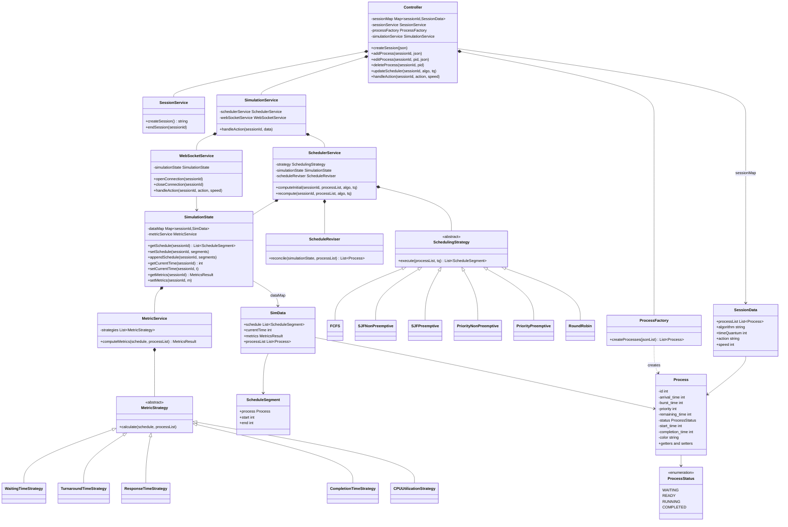

# CPU Scheduling Simulator — Design Doc

```mermaid
classDiagram
  class Controller {
    -sessionMap Map~sessionId,SessionData~
    -sessionService SessionService
    -processFactory ProcessFactory
    -simulationService SimulationService
    +createSession(json)
    +addProcess(sessionId, json)
    +editProcess(sessionId, pid, json)
    +deleteProcess(sessionId, pid)
    +updateScheduler(sessionId, algo, tq)
    +handleAction(sessionId, action, speed)
  }
  class SessionData {
    +processList List~Process~
    +algorithm string
    +timeQuantum int
    +action string
    +speed int
  }
  class SessionService {
    +createSession() string
    +endSession(sessionId)
  }
  class ProcessFactory {
    +createProcesses(jsonList) List~Process~
  }
  class Process {
    -id int
    -arrival_time int
    -burst_time int
    -priority int
    -remaining_time int
    -status ProcessStatus
    -start_time int
    -completion_time int
    -color string
    +getters and setters
  }
  class ProcessStatus {
    <<enumeration>>
    WAITING
    READY
    RUNNING
    COMPLETED
  }
  class SimulationService {
    -schedulerService SchedulerService
    -webSocketService WebSocketService
    +handleAction(sessionId, data)
  }
  class SchedulerService {
    -strategy SchedulingStrategy
    -simulationState SimulationState
    -scheduleReviser ScheduleReviser
    +computeInitial(sessionId, processList, algo, tq)
    +recompute(sessionId, processList, algo, tq)
  }
  class SchedulingStrategy {
    <<abstract>>
    +execute(processList, tq) List~ScheduleSegment~
  }
  class FCFS
  class SJFNonPreemptive
  class SJFPreemptive
  class PriorityNonPreemptive
  class PriorityPreemptive
  class RoundRobin
  class ScheduleReviser {
    +reconcile(simulationState, processList) List~Process~
  }
  class SimulationState {
    -dataMap Map~sessionId,SimData~
    -metricService MetricService
    +getSchedule(sessionId) List~ScheduleSegment~
    +setSchedule(sessionId, segments)
    +appendSchedule(sessionId, segments)
    +getCurrentTime(sessionId) int
    +setCurrentTime(sessionId, t)
    +getMetrics(sessionId) MetricsResult
    +setMetrics(sessionId, m)
  }
  class SimData {
    +schedule List~ScheduleSegment~
    +currentTime int
    +metrics MetricsResult
    +processList List~Process~
  }
  class ScheduleSegment {
    +process Process
    +start int
    +end int
  }
  class MetricService {
    -strategies List~MetricStrategy~
    +computeMetrics(schedule, processList) MetricsResult
  }
  class MetricStrategy {
    <<abstract>>
    +calculate(schedule, processList)
  }
  class WaitingTimeStrategy
  class TurnaroundTimeStrategy
  class ResponseTimeStrategy
  class CompletionTimeStrategy
  class CPUUtilizationStrategy
  class WebSocketService {
    -simulationState SimulationState
    +openConnection(sessionId)
    +closeConnection(sessionId)
    +handleAction(sessionId, action, speed)
  }

  Controller *-- SessionService
  Controller *-- ProcessFactory
  Controller *-- SimulationService
  Controller --> SessionData : sessionMap
  SessionData --> Process
  ProcessFactory ..> Process : creates
  Process --> ProcessStatus
  SimulationService *-- SchedulerService
  SimulationService *-- WebSocketService
  SchedulerService *-- SchedulingStrategy
  SchedulerService *-- SimulationState
  SchedulerService *-- ScheduleReviser
  SchedulingStrategy <|-- FCFS
  SchedulingStrategy <|-- SJFNonPreemptive
  SchedulingStrategy <|-- SJFPreemptive
  SchedulingStrategy <|-- PriorityNonPreemptive
  SchedulingStrategy <|-- PriorityPreemptive
  SchedulingStrategy <|-- RoundRobin
  SimulationState *-- MetricService
  SimulationState --> SimData : dataMap
  SimData --> ScheduleSegment
  SimData --> Process
  MetricService *-- MetricStrategy
  MetricStrategy <|-- WaitingTimeStrategy
  MetricStrategy <|-- TurnaroundTimeStrategy
  MetricStrategy <|-- ResponseTimeStrategy
  MetricStrategy <|-- CompletionTimeStrategy
  MetricStrategy <|-- CPUUtilizationStrategy
  WebSocketService --> SimulationState
```